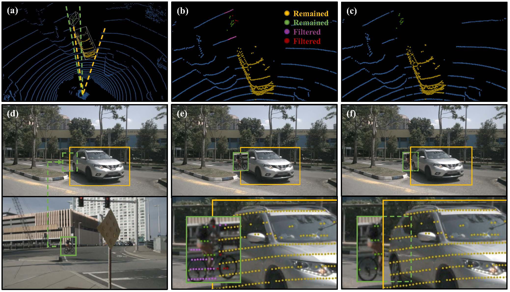

# PointAugmenting: Cross-Modal Augmentation for 3D Object Detection

GT-Paste data augmentation for cross-modal 3D object detection, which preserves the consistency between camera and LiDAR data.

<p align="center">  </p>

> [**CVPR21 - PointAugmenting: Cross-Modal Augmentation for 3D Object Detection**](https://openaccess.thecvf.com/content/CVPR2021/html/Wang_PointAugmenting_Cross-Modal_Augmentation_for_3D_Object_Detection_CVPR_2021_paper.html)          
> Chunwei Wang, Chao Ma, Ming Zhu, Xiaokang Yang        

    @inproceedings{wang2021pointaugmenting,
      title={PointAugmenting: Cross-Modal Augmentation for 3D Object  Detection},
      author={Wang, Chunwei and Ma, Chao and Zhu, Ming and Yang, Xiaokang},
      booktitle={Proceedings of the IEEE/CVF Conference on Computer Vision and Pattern Recognition},
      pages={11794--11803},
      year={2021}
    }


## Main results
#### 3D detection on nuScenes test set 

|         |  MAP ↑  | NDS ↑  | Car | Truck | C.V. | Bus | Trailer | Barrier | Motor. | Bicycle | Ped. | T.C. |
|---------|---------|--------|--------|--------|--------|--------|--------|--------|--------|--------|--------|--------|
| CenterPoint | 60.3 | 67.3 | 85.2 | 53.5 | 20.0 | 63.6 | 56.0 | 71.1 | 59.5 | 30.7 | 84.6 | 78.4 |
| PointAugmenting | 66.8 | 71.0 | 87.5 | 57.3 |28.0 | 65.2 | 60.7 | 72.6 | 74.3 | 50.9 | 87.9 | 83.6 |

## Installation

Please refer to the installation and usage of [CenterPoint](https://github.com/tianweiy/CenterPoint/blob/master/docs/INSTALL.md).

### Image Backbone
load DCNv2 
```bash
cd det3d/models/img_backbones
git clone https://github.com/CharlesShang/DCNv2
cd DCNv2
sh make.sh
```
For 2D image feature extraction, we use the pretrained [DLA34](https://github.com/xingyizhou/CenterTrack/blob/master/readme/MODEL_ZOO.md) model from CenterTrack.
Please download the model and put it into file folder /pretrained_model.


## Data Preparation
Modified from [CenterPoint](https://github.com/tianweiy/CenterPoint/blob/master/docs/NUSC.md)'s original document.

Step 1: Download data and organise as follows
```
# For nuScenes Dataset         
└── NUSCENES_DATASET_ROOT
       ├── samples       <-- key frames
       ├── sweeps        <-- frames without annotation
       ├── maps          <-- unused
       ├── v1.0-trainval <-- metadata
```
Step 2: Create a symlink to the dataset root
```bash
mkdir data && cd data
ln -s DATA_ROOT 
mv DATA_ROOT nuScenes # rename to nuScenes
```

Step 3: Create data
```bash
# nuScenes
python tools/create_data.py nuscenes_data_prep --root_path=NUSCENES_TRAINVAL_DATASET_ROOT --version="v1.0-trainval" --nsweeps=10 --rate==1
```

In the end, the data and info files should be organized as follows
```
# For nuScenes Dataset 
└── PointAugmenting
       └── data    
              └── nuScenes 
                     ├── samples       <-- key frames
                     ├── sweeps        <-- frames without annotation
                     ├── maps          <-- unused
                     |── v1.0-trainval <-- metadata and annotations
                     |── infos_train_10sweeps_withvelo_filter_True_100rate_crossmodal.pkl <-- train annotations
                     |── infos_val_10sweeps_withvelo_filter_True_crossmodal.pkl <-- val annotations
                     |── dbinfos_100rate_10sweeps_withvelo_crossmodal.pkl <-- GT database info files
                     |── gt_database_100rate_10sweeps_withvelo_crossmodal <-- GT database 
```

## Train & Evaluate
Modified from [CenterPoint](https://github.com/tianweiy/CenterPoint/blob/master/docs/NUSC.md)'s original document.

Use the following command to start a distributed training using 4 GPUs. The models and logs will be saved to work_dirs/CONFIG_NAME
```bash
python -m torch.distributed.launch --nproc_per_node=4 ./tools/train.py --config=CONFIG_PATH
```

For distributed testing with 4 gpus,
```bash
python -m torch.distributed.launch --nproc_per_node=4 ./tools/dist_test.py --config=CONFIG_PATH --work_dir work_dirs/CONFIG_NAME --checkpoint work_dirs/CONFIG_NAME/latest.pth
```

## Acknowlegement
This project is not possible without multiple great opensourced codebases. We list some notable examples below.  
* [CenterPoint](https://github.com/tianweiy/CenterPoint) 
* [det3d](https://github.com/poodarchu/det3d)
* [CenterTrack](https://github.com/xingyizhou/CenterTrack)
* [CenterNet](https://github.com/xingyizhou/CenterNet) 